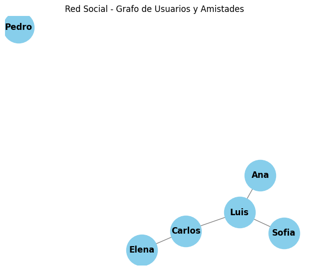

# Sistema Integrado de Gestión y Recomendación en una Red Social

## Descripción General

Este proyecto implementa un sistema básico de red social que permite la gestión de usuarios y conexiones entre ellos, junto con recomendaciones de amistad utilizando técnicas de grafos. La solución se enfoca en aplicar programación orientada a objetos, estructuras de datos avanzadas y principios SOLID.

---

## Flujo del Sistema

1. **Inicialización de la red social**
   - Se crea una instancia de la clase `RedSocial`.

2. **Registro de usuarios**
   - Se agregan usuarios mediante `agregar_usuario(nombre)`.

3. **Creación de conexiones**
   - Los usuarios pueden agregarse como amigos a través de `agregar_amigo(usuario1, usuario2)`.

4. **Recomendación de amigos**
   - Se sugieren usuarios que no están conectados directamente, pero tienen amigos en común mediante `sugerencias_amigos(usuario)`.

5. **Recorrido del grafo**
   - Se utiliza el algoritmo BFS para recorrer la red desde un usuario específico mediante `bfs(usuario)`.

---

## Estructura del Código

- `Usuario`: Clase que representa a un usuario con su nombre y lista de amigos.
- `RedSocial`: Maneja toda la lógica de red:
  - Registro de usuarios.
  - Agregado de amigos.
  - Sugerencias de amistad (grafo no dirigido).
  - Recorrido BFS del grafo.
- Manejo de excepciones:
  - `UsuarioExisteError`, `UsuarioNoExisteError`, `ConexionExistenteError`: controlan errores comunes y aseguran integridad del sistema.

---

## Decisiones de Diseño

- **Uso de clases y encapsulación**: Se sigue una estructura orientada a objetos clara, separando responsabilidades entre usuarios y la red.
- **Estructura tipo grafo**: La red social se implementa como un grafo no dirigido. Cada nodo representa un usuario y los enlaces representan amistades.
- **SOLID**: Se sigue el principio de responsabilidad única para cada clase.
- **Reutilización y modularidad**: El diseño permite extender fácilmente funcionalidades como eliminar amigos o visualizar rutas.

---

## Análisis de Rendimiento

- **Agregar usuario**: O(1), al usar un diccionario para almacenamiento.
- **Agregar amistad**: O(1), al tratarse de una operación de conjunto.
- **Sugerencia de amigos**: O(n), donde n es el número de amigos de los amigos del usuario.
- **BFS**: O(n + m), donde n es el número de usuarios y m el número de conexiones.

> La eficiencia es adecuada para una red pequeña-mediana, aunque no se ha optimizado para redes sociales masivas.

---

## Capturas del Sistema

> 📸 **[Aquí se deben incluir capturas de la ejecución del sistema en consola o interfaz, si aplica.]**

      # Sistema Integrado de Gestión y Recomendación en una Red Social

      import time
      import random
      import networkx as nx
      from collections import deque, defaultdict
      import matplotlib.pyplot as plt
      import numpy as np
      from numba import njit
      # ==============================
      # EXCEPCIONES PERSONALIZADAS
      # ==============================
      class UsuarioExisteError(Exception):
          pass

      class UsuarioNoExisteError(Exception):
          pass

      class ConexionInvalidaError(Exception):
          pass
      # ==============================
      # CLASES Y POO CON SOLID
      # ==============================
      class NodoUsuario:
          def __init__(self, nombre):
              self.nombre = nombre
              self.amigos = set()

          def agregar_amigo(self, amigo):
              if amigo == self.nombre:
                  raise ConexionInvalidaError("Un usuario no puede agregarse a sí mismo como amigo.")
        self.amigos.add(amigo)

      class RedSocial:
          def __init__(self):
              self.usuarios = {}

      def agregar_usuario(self, nombre):
        if nombre in self.usuarios:
            raise UsuarioExisteError(f"El usuario '{nombre}' ya existe.")
        self.usuarios[nombre] = NodoUsuario(nombre)

    def agregar_amigo(self, nombre1, nombre2):
        if nombre1 not in self.usuarios or nombre2 not in self.usuarios:
            raise UsuarioNoExisteError("Uno o ambos usuarios no existen.")
        self.usuarios[nombre1].agregar_amigo(nombre2)
        self.usuarios[nombre2].agregar_amigo(nombre1)

    def sugerencias_amigos(self, nombre):
        if nombre not in self.usuarios:
            raise UsuarioNoExisteError(f"El usuario '{nombre}' no existe.")
        conocidos = self.usuarios[nombre].amigos
        sugerencias = set()
        for amigo in conocidos:
            sugerencias.update(self.usuarios[amigo].amigos - conocidos - {nombre})
        return list(sugerencias)

    def bfs(self, inicio):
        visitados = set()
        cola = deque([inicio])
        recorrido = []
        while cola:
            actual = cola.popleft()
            if actual not in visitados:
                visitados.add(actual)
                recorrido.append(actual)
                cola.extend(self.usuarios[actual].amigos - visitados)
        return recorrido
      # ==============================
      # OPTIMIZACIÓN
      # ==============================
      @njit
      def calcular_conexiones_opt(num_usuarios):
          matriz = np.zeros((num_usuarios, num_usuarios))
          for i in range(num_usuarios):
              for j in range(i + 1, num_usuarios):
                  matriz[i][j] = 1
                  matriz[j][i] = 1
          return matriz

      def calcular_conexiones(num_usuarios):
          matriz = np.zeros((num_usuarios, num_usuarios))
          for i in range(num_usuarios):
              for j in range(i + 1, num_usuarios):
                  matriz[i][j] = 1
                  matriz[j][i] = 1
          return matriz
      # ==============================
      # PRUEBA DE FUNCIONALIDAD
      # ==============================
      red = RedSocial()
      usuarios_demo = ["Ana", "Luis", "Carlos", "Elena", "Sofia", "Pedro", "Carlos"]
      for u in usuarios_demo:
          try:
              red.agregar_usuario(u)
          except UsuarioExisteError as e:
              print(e)

      # Crear algunas conexiones
      red.agregar_amigo("Ana", "Luis")
      red.agregar_amigo("Luis", "Carlos")
      red.agregar_amigo("Carlos", "Elena")
      red.agregar_amigo("Sofia", "Luis")

      print("Sugerencias para Ana:", red.sugerencias_amigos("Ana"))
      print("Recorrido BFS desde Luis:", red.bfs("Luis"))
      # ==============================
      # VISUALIZACIÓN DEL GRAFO
      # ==============================

      # Crear un grafo simple de una red social
      G = nx.Graph()

      # Agregar nodos (usuarios)
      usuarios = ["Ana", "Luis", "Carlos", "Elena", "Sofia", "Pedro"]
      G.add_nodes_from(usuarios)

      # Agregar conexiones (amistades)
      amistades = [
          ("Ana", "Luis"),
          ("Luis", "Carlos"),
          ("Carlos", "Elena"),
          ("Sofia", "Luis")
      ]
      G.add_edges_from(amistades)

      # Dibujar el grafo
      plt.figure(figsize=(6, 5))
      pos = nx.spring_layout(G, seed=42)
      nx.draw(G, pos, with_labels=True, node_color="skyblue", node_size=2000, font_size=12, font_weight="bold", edge_color="gray")
      plt.title("Red Social - Grafo de Usuarios y Amistades")
      plt.tight_layout()
      plt.show()
      # ==============================
      # MEDICIÓN DE RENDIMIENTO
      # ==============================
      N = 10_000
      start = time.time()
      calcular_conexiones(N)
      no_opt_time = time.time() - start

      start = time.time()
      calcular_conexiones_opt(N)
      opt_time = time.time() - start
      # ==============================
      # GRÁFICA DE RENDIMIENTO
      # ==============================
      x = ["Sin optimizar", "Optimizado"]
      y = [no_opt_time, opt_time]
      plt.bar(x, y, color=["red", "green"])
      plt.ylabel("Tiempo (s)")
      plt.title("Comparación de rendimiento")
      plt.show()

##Salidas

      El usuario 'Carlos' ya existe.
      Sugerencias para Ana: ['Carlos', 'Sofia']
      Recorrido BFS desde Luis: ['Luis', 'Carlos', 'Ana', 'Sofia', 'Elena']

      

---

## Conclusión

Este proyecto demuestra cómo se puede simular una red social simple mediante estructuras de grafos y programación orientada a objetos. Se lograron implementar funcionalidades clave como el registro de usuarios, conexión entre ellos, recomendaciones inteligentes de amistad y recorrido por la red. Además, se aplicaron principios sólidos de diseño de software que hacen al sistema mantenible y extensible para futuras mejoras.

---

## Autor

Desarrollado por [Claudio Andrés Díaz Vargas]  
Curso: [Evaluación Modular]  
Fecha: [Junio 2025]

